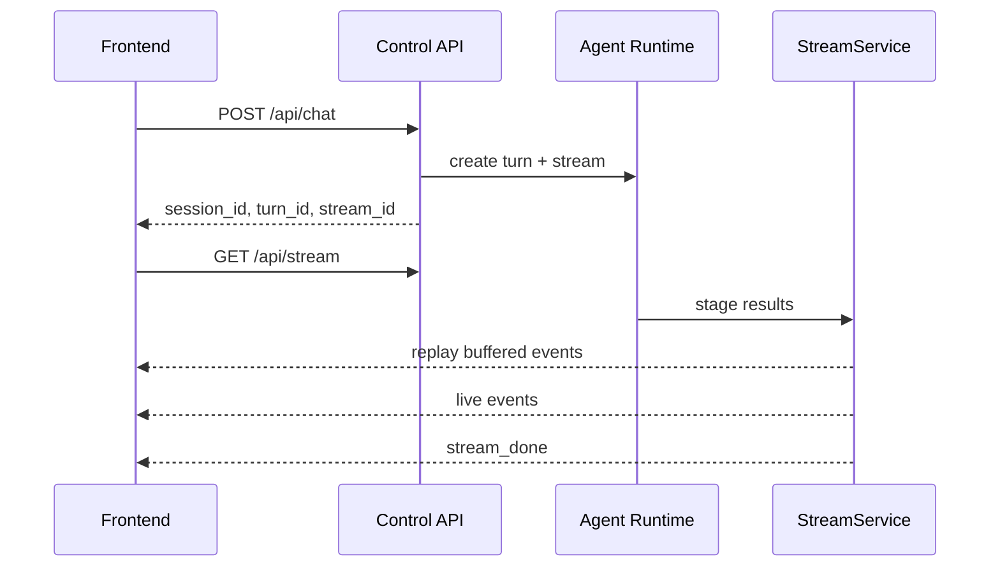

# 控制类 API 契约

## 1. 文档目标

本文档定义项目中控制类接口的请求、响应、错误格式与连接语义。

它主要服务于：

- `api.routes.sessions`
- `api.routes.chat`
- `api.routes.stream`
- 内置测试页
- 未来正式前端

本文档只定义“启动与控制”，不承载流式业务内容本身。

流式业务事件格式以 [docs/streaming-event-contract.md](docs/streaming-event-contract.md) 为准。

## 2. 与现有文档的关系

- [docs/project-architecture.md](docs/project-architecture.md)：定义系统级接口入口与 `session_id / turn_id / stream_id` 关系
- [docs/shopping-agent-architecture.md](docs/shopping-agent-architecture.md)：定义 Agent 节点和阶段结果
- [docs/streaming-event-contract.md](docs/streaming-event-contract.md)：定义 `status`、`candidate_card`、`top3_card` 等流式事件
- [docs/langgraph-topology.md](docs/langgraph-topology.md)：定义 Agent 运行时拓扑和阶段状态

本文件不重复定义流式事件 payload，只定义如何启动和消费这些事件。

## 3. 设计原则

## 3.1 控制与结果分离

- 控制类接口负责“创建会话、启动一轮推荐、建立流连接”
- 流式接口负责“返回推荐过程中的事件”
- `/api/chat` 不直接返回完整推荐内容

## 3.2 主控制模式

`MVP` 默认采用：

- `chat_then_stream`

即：

1. 前端先调用 `POST /api/chat`
2. 后端返回 `session_id`、`turn_id`、`stream_id`
3. 前端再调用 `GET /api/stream`
4. 后端开始回放已缓冲事件并继续实时推送后续事件

## 3.3 为什么不是“结果直接塞进 /api/chat”

原因：

- 控制响应应尽快返回
- 流式推荐生命周期通常长于普通请求
- 同一轮推荐可能需要断线重连、事件重放和日志排查

## 3.4 防止首批事件丢失

由于采用 `chat_then_stream`，必须补一条强约束：

- `POST /api/chat` 一旦启动推荐，后端必须为该 `stream_id` 建立事件缓冲区
- 在前端尚未连接 `GET /api/stream` 之前，已经产生的事件也要按 `seq` 保存
- 当前端连上流时，后端先补发尚未收到的事件，再继续实时推送

否则前端会丢失最早的 `status(searching)` 或 `candidate_card`。

## 4. 标识关系

| 标识 | 含义 | 生命周期 |
| --- | --- | --- |
| `session_id` | 一段多轮导购会话 | 跨多轮请求 |
| `turn_id` | 一次用户输入触发的一轮推荐 | 单轮有效 |
| `stream_id` | 当前轮对应的结果流 | 单轮流式输出有效 |

关系约束：

- 一个 `session_id` 下可以有多条 `turn_id`
- 一条 `turn_id` 默认只对应一条主 `stream_id`
- 一个 `stream_id` 只能归属于一个 `session_id + turn_id`

## 5. 统一响应结构

## 5.1 成功响应 envelope

控制类接口建议统一返回：

```json
{
  "ok": true,
  "data": {},
  "error": null,
  "meta": {
    "request_id": "req_20260414_001",
    "server_time": "2026-04-14T10:20:30Z"
  }
}
```

## 5.2 失败响应 envelope

```json
{
  "ok": false,
  "data": null,
  "error": {
    "code": "INVALID_ARGUMENT",
    "message": "message 不能为空",
    "details": {
      "field": "message"
    },
    "retryable": false
  },
  "meta": {
    "request_id": "req_20260414_001",
    "server_time": "2026-04-14T10:20:30Z"
  }
}
```

## 5.3 错误对象定义

| 字段 | 类型 | 说明 |
| --- | --- | --- |
| `code` | string | 机器可读错误码 |
| `message` | string | 给前端或调试看的短信息 |
| `details` | object/null | 结构化补充信息 |
| `retryable` | boolean | 是否建议前端自动重试 |

## 6. `POST /api/sessions`

## 6.1 用途

创建新会话，或显式续用一个已有会话。

它适合：

- 测试页首次进入时创建会话
- 正式前端恢复先前会话时显式续用

## 6.2 请求体

```json
{
  "session_id": null,
  "client_id": "web_test_page",
  "metadata": {
    "locale": "en-US",
    "entry": "internal_test_page"
  }
}
```

字段说明：

| 字段 | 必填 | 说明 |
| --- | --- | --- |
| `session_id` | 否 | 若传入，则表示尝试续用 |
| `client_id` | 否 | 调用方标识 |
| `metadata` | 否 | 客户端元信息 |

## 6.3 默认行为

- 若 `session_id` 为空，创建新会话
- 若 `session_id` 存在且可用，返回该会话
- 若 `session_id` 不存在，返回 `404`

## 6.4 成功响应

```json
{
  "ok": true,
  "data": {
    "session_id": "sess_abc123",
    "is_new": true,
    "expires_at": null
  },
  "error": null,
  "meta": {
    "request_id": "req_001",
    "server_time": "2026-04-14T10:20:30Z"
  }
}
```

## 7. `POST /api/chat`

## 7.1 用途

提交一轮导购输入，并启动当前轮推荐执行。

该接口只负责：

- 校验请求
- 创建或续用 `session_id`
- 创建 `turn_id`
- 创建 `stream_id`
- 提交 Agent 任务
- 返回控制面元信息

它不直接返回推荐结果正文。

## 7.2 请求体

```json
{
  "session_id": "sess_abc123",
  "message": "帮我看看适合学生党的无线耳机，预算 500 以内",
  "client_request_id": "chat_001",
  "context": {
    "ui_locale": "zh-CN",
    "market": "US"
  },
  "options": {
    "stream_mode": "chat_then_stream",
    "allow_cached_products": true,
    "debug": false
  }
}
```

字段说明：

| 字段 | 必填 | 说明 |
| --- | --- | --- |
| `session_id` | 否 | 不传则由服务端自动创建 |
| `message` | 是 | 用户当前轮原始输入 |
| `client_request_id` | 否 | 客户端幂等键 |
| `context` | 否 | 与本轮展示相关的上下文，不直接进入用户语义 |
| `options.stream_mode` | 否 | 当前仅允许 `chat_then_stream` |
| `options.allow_cached_products` | 否 | 是否允许命中本地缓存 |
| `options.debug` | 否 | 是否返回额外调试信息 |

## 7.3 请求校验规则

- `message` 不能为空字符串
- `message` 长度建议限制在 `1..4000`
- `session_id` 若传入，必须是已知会话
- `stream_mode` 若传入，当前只能为 `chat_then_stream`

## 7.4 成功响应

```json
{
  "ok": true,
  "data": {
    "session_id": "sess_abc123",
    "turn_id": "turn_0003",
    "stream_id": "stream_20260414_003",
    "status": "accepted",
    "stream_url": "/api/stream?session_id=sess_abc123&turn_id=turn_0003&stream_id=stream_20260414_003",
    "replay_from_seq": 1
  },
  "error": null,
  "meta": {
    "request_id": "req_002",
    "server_time": "2026-04-14T10:20:30Z"
  }
}
```

## 7.5 响应语义

| 字段 | 说明 |
| --- | --- |
| `status=accepted` | 说明推荐任务已进入执行或排队 |
| `stream_url` | 前端可直接建立流连接的地址 |
| `replay_from_seq` | 默认从第 1 条事件开始接收 |

## 7.6 幂等规则

若传入 `client_request_id`，服务端应在同一个 `session_id` 下按如下处理：

- 相同 `client_request_id` + 相同 `message`：返回同一个 `turn_id` 和 `stream_id`
- 相同 `client_request_id` + 不同 `message`：返回 `409 CONFLICT`

推荐保留幂等窗口：

- 至少 10 分钟

## 7.7 重复提交处理

若前端因超时重复提交：

- 服务端不应重复创建新的推荐轮次
- 应返回已有的 `turn_id`、`stream_id`

## 8. `GET /api/stream`

## 8.1 用途

建立 `SSE` 连接，消费某一轮推荐过程中的流式事件。

## 8.2 Query 参数

建议参数如下：

| 参数 | 必填 | 说明 |
| --- | --- | --- |
| `session_id` | 是 | 所属会话 |
| `turn_id` | 是 | 所属轮次 |
| `stream_id` | 是 | 当前事件流 |
| `last_seq` | 否 | 前端已确认收到的最后一个序号 |
| `replay` | 否 | 是否允许回放，默认 `true` |

示例：

```text
/api/stream?session_id=sess_abc123&turn_id=turn_0003&stream_id=stream_20260414_003&last_seq=0&replay=true
```

## 8.3 连接语义

连接建立后，后端必须按以下顺序处理：

1. 校验 `session_id / turn_id / stream_id` 是否匹配
2. 若 `replay=true`，先发送 `last_seq + 1` 之后的缓冲事件
3. 再继续推送实时事件
4. 完成时发送 `stream_done` 或 `error`
5. 本轮流自然结束

## 8.4 `last_seq` 语义

- 若未传 `last_seq`，等价于 `0`
- 若前端断线重连，应该带上已消费的最后一条 `seq`
- 后端只需要补发 `seq > last_seq` 的事件

## 8.5 返回内容

`GET /api/stream` 返回的是 `SSE` 数据流。

单条事件的数据体，必须遵循 [docs/streaming-event-contract.md](docs/streaming-event-contract.md) 中定义的统一 event envelope。

可选的 `SSE` 层包装示例：

```text
event: message
id: evt_000012
data: {"version":"v1","event_id":"evt_000012","stream_id":"stream_20260414_003","session_id":"sess_abc123","turn_id":"turn_0003","seq":12,"type":"candidate_card","phase":"candidate_ready","entity":{"kind":"product","id":"dfs:gshopping:pid:3805205938126402128"},"meta":{"source_stage":"products","is_partial":true,"replace":false},"payload":{}}
```

## 8.6 心跳

建议：

- `SSE` 连接每 `15~30` 秒发送一次心跳注释或空事件
- 心跳不计入业务 `seq`

## 8.7 非法连接处理

| 场景 | 建议响应 |
| --- | --- |
| `stream_id` 不存在 | `404` |
| `stream_id` 与 `turn_id` 不匹配 | `409` |
| 当前流已过期且无可回放日志 | `410` |
| 未授权访问他人会话 | `403` |

## 9. 推荐的控制时序

## 9.1 主路径

推荐前端按以下顺序联调：

1. `POST /api/sessions` 获取 `session_id`
2. `POST /api/chat` 提交当前轮输入，拿到 `turn_id` 和 `stream_id`
3. `GET /api/stream` 建立流连接
4. 读取 `status`、`candidate_card`、`top3_card`、`product_patch` 等事件
5. 收到 `stream_done` 或 `error` 结束本轮

## 9.2 时序示意



## 10. 错误码建议

建议至少定义以下控制类错误码：

| HTTP | code | 含义 | retryable |
| --- | --- | --- | --- |
| `400` | `INVALID_ARGUMENT` | 参数缺失或格式错误 | `false` |
| `400` | `UNSUPPORTED_STREAM_MODE` | 不支持的流模式 | `false` |
| `403` | `FORBIDDEN` | 无权限访问该会话或流 | `false` |
| `404` | `SESSION_NOT_FOUND` | 会话不存在 | `false` |
| `404` | `STREAM_NOT_FOUND` | 流不存在 | `false` |
| `409` | `IDEMPOTENCY_CONFLICT` | 幂等键冲突 | `false` |
| `409` | `STREAM_BINDING_MISMATCH` | `session/turn/stream` 组合不一致 | `false` |
| `410` | `STREAM_EXPIRED` | 流已过期且无法重放 | `false` |
| `429` | `RATE_LIMITED` | 请求过快 | `true` |
| `500` | `INTERNAL_ERROR` | 服务端内部错误 | `true` |
| `503` | `SERVICE_UNAVAILABLE` | 依赖不可用 | `true` |

## 11. 与流式事件契约的边界

这里必须明确：

- `/api/chat` 和 `/api/sessions` 返回控制面 JSON
- `/api/stream` 返回事件流
- `warning`、`status`、`error`、`stream_done` 等业务事件属于流式 contract，不属于控制接口 JSON body

也就是说：

- 控制接口的 `error` 用于“这个 HTTP 请求本身有没有成功”
- 流式事件里的 `error` 用于“这轮推荐流在执行中是否失败”

两者不能混用。

## 12. 服务端最小实现建议

为了让 `MVP` 稳定联调，建议服务端至少具备：

1. `session_store`：存 `session_id`
2. `turn_store`：存 `turn_id -> session_id`
3. `stream_store`：存 `stream_id -> turn_id`
4. `event_buffer`：按 `stream_id` 和 `seq` 缓存事件
5. `event_log`：可选持久化，支持断线重放和排障

## 13. 总结

这份控制类 API 契约的核心，是把“启动一轮推荐”和“消费这轮事件流”彻底分开，同时通过 `stream_id + seq + replay` 机制保证：

- `chat_then_stream` 模式不会丢首批事件
- 测试页和未来正式前端都能按同一套接口联调
- 控制错误与推荐流错误能被清晰地区分
