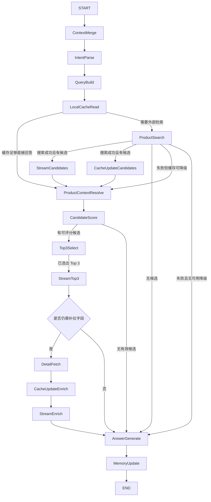

# LangGraph 状态图拓扑规范

## 1. 文档目标

本文档把 [docs/shopping-agent-architecture.md](docs/shopping-agent-architecture.md) 中已经定义的 15 个运行时节点，收束为可直接指导 `graph.py` 编码的拓扑规范。

本文件重点回答：

- 图的入口和终点是什么
- 节点之间的边如何连接
- 哪些条件会触发分支
- 细节补全如何并行
- DataForSEO、LLM、缓存异常时如何降级
- 流式阶段何时切换，但节点本身不直接产出前端事件

## 2. 与现有文档的关系

- [docs/project-architecture.md](docs/project-architecture.md)：定义 `StreamService` 负责事件映射，不由 Agent 直接产出前端事件
- [docs/shopping-agent-architecture.md](docs/shopping-agent-architecture.md)：定义 15 个运行时节点和状态语义
- [docs/streaming-event-contract.md](docs/streaming-event-contract.md)：定义 `phase` 与事件 envelope
- [docs/dataforseo-field-mapping.md](docs/dataforseo-field-mapping.md)：定义外部数据如何进入内部模型

本文件不重复定义字段映射和事件格式，只定义状态图。

## 3. 图设计约束

编码时必须满足以下约束：

1. `Agent` 节点只能读写 `AgentState` 与产出阶段性领域结果，不能直接拼装前端事件。
2. 任一阶段一旦产出可展示结果，必须立即写入 `stream_state`，供 `StreamService` 立刻转发。
3. `Products` 搜索必须发生在推荐之前，模型不能跳过检索直接推荐。
4. `DetailFetch` 只补拉缺失字段，不做无意义全量重抓。
5. 任何异常都优先走“保底可回答”而不是“整轮失败”。

## 4. AgentState 最小必需字段

## 4.1 状态字段

建议 `AgentState` 至少包含以下字段：

| 字段 | 类型 | 说明 |
| --- | --- | --- |
| `messages` | list | 当前会话消息历史 |
| `session_summary` | string | 会话压缩摘要 |
| `user_requirements` | object | 当前累计需求 |
| `hard_constraints` | object | 预算、尺寸、平台等硬条件 |
| `soft_preferences` | object | 品牌偏好、颜值、性价比等软偏好 |
| `intent` | object | 当前轮意图识别结果 |
| `query_plan` | object | 本轮搜索计划 |
| `last_query` | object/null | 上一轮已实际执行的查询快照 |
| `mentioned_products` | list | 用户提及过的商品引用 |
| `followup_target_product` | string/null | 当前追问目标商品 |
| `product_catalog` | list | 轻量候选索引 |
| `product_field_registry` | object | 每个商品的字段可用性 |
| `cache_refs` | object | 会话商品与缓存实体映射 |
| `candidate_products` | list | 本轮候选商品 |
| `recommended_products` | list | 本轮 Top 3 |
| `enrichment_plan` | object | Top 3 缺失字段与抓取计划 |
| `stream_state` | object | 当前阶段与待发送领域结果 |
| `warnings` | list | 可恢复异常和降级提示 |
| `errors` | list | 结构化错误 |
| `final_answer` | object/null | 最终回答结果 |

## 4.2 字段读写归属

| 字段 | 主写节点 | 主要读节点 |
| --- | --- | --- |
| `messages` | `ContextMerge` | 全图 |
| `user_requirements` / `hard_constraints` / `soft_preferences` | `ContextMerge` / `IntentParse` / `MemoryUpdate` | `QueryBuild` / `CandidateScore` / `AnswerGenerate` |
| `intent` | `IntentParse` | `QueryBuild` / `LocalCacheRead` |
| `query_plan` | `QueryBuild` | `LocalCacheRead` / `ProductSearch` |
| `last_query` | `MemoryUpdate` | `QueryBuild` / `LocalCacheRead` |
| `followup_target_product` | `IntentParse` / `ProductContextResolve` | `LocalCacheRead` / `DetailFetch` |
| `product_catalog` | `ProductSearch` / `CacheUpdate` / `MemoryUpdate` | `ProductContextResolve` / `CandidateScore` |
| `product_field_registry` | `LocalCacheRead` / `CacheUpdate` / `DetailFetch` | `ProductContextResolve` / `DetailFetch` / `AnswerGenerate` |
| `candidate_products` | `ProductSearch` / `LocalCacheRead` | `CandidateScore` |
| `recommended_products` | `Top3Select` | `StreamTop3` / `DetailFetch` / `AnswerGenerate` |
| `enrichment_plan` | `DetailFetch` | `StreamEnrich` / `AnswerGenerate` |
| `stream_state` | `StreamCandidates` / `StreamTop3` / `StreamEnrich` | `StreamService` |
| `warnings` | 任意节点 | `AnswerGenerate` / `MemoryUpdate` |
| `errors` | 任意节点 | 条件边 / `AnswerGenerate` |
| `final_answer` | `AnswerGenerate` | `MemoryUpdate` |

这里需要明确区分：

- `query_plan` 表示本轮准备执行的搜索计划，是 `QueryBuild` 的直接输出
- `last_query` 表示上一轮已经实际执行过的查询快照，主要用于避免重复搜索、辅助 `LocalCacheRead` 判断缓存是否覆盖
- 当本轮搜索真正执行完成后，应由 `MemoryUpdate` 或相邻收尾逻辑把本轮实际执行查询回写为新的 `last_query`

## 5. 节点与拓扑总览

## 5.1 入口与终点

- `START` 后的第一个节点固定为 `ContextMerge`
- 终止节点固定为 `END`
- 正常完成路径的最后一个业务节点固定为 `MemoryUpdate`

## 5.2 正式状态图

说明：

- 图中的 `CacheUpdateCandidates` 与 `CacheUpdateEnrich` 在实现层都可落在 `CacheUpdate` 模块中
- `EnrichmentDecision` 是条件边概念，不要求单独建文件
- `StreamCandidates` / `StreamTop3` / `StreamEnrich` 只写 `stream_state`，不直接写 SSE

## 6. 节点边定义

## 6.1 主干边

| 上游 | 下游 | 触发条件 |
| --- | --- | --- |
| `START` | `ContextMerge` | 无条件 |
| `ContextMerge` | `IntentParse` | 无条件 |
| `IntentParse` | `QueryBuild` | 无条件 |
| `QueryBuild` | `LocalCacheRead` | 无条件 |
| `ProductContextResolve` | `CandidateScore` | 已拿到候选或目标商品上下文 |
| `CandidateScore` | `Top3Select` | 至少存在一个可评分候选 |
| `Top3Select` | `StreamTop3` | Top 3 已选出 |
| `StreamTop3` | `EnrichmentDecision` | Top 3 阶段结果已写入 `stream_state` |
| `AnswerGenerate` | `MemoryUpdate` | 已形成最终回答 |
| `MemoryUpdate` | `END` | 无条件 |

## 6.2 `LocalCacheRead` 分支

| 条件 | 去向 | 含义 |
| --- | --- | --- |
| `cache_can_answer = true` | `ProductContextResolve` | 当前轮问题可由缓存支持，不需要重新搜索 |
| `cache_can_answer = false` | `ProductSearch` | 缓存不足以支持当前轮回答 |

其中 `cache_can_answer = true` 至少满足以下之一：

- 用户在追问已知商品，且 `followup_target_product` 已解析成功
- 需要的字段都在缓存中，且未过期
- 当前轮只是围绕已有候选做比较，不需要新增候选池

## 6.3 `ProductSearch` 分支

| 条件 | 去向 | 含义 |
| --- | --- | --- |
| `search_ok and candidates_count > 0` | `StreamCandidates` + `CacheUpdateCandidates` | 搜索成功，进入候选阶段 |
| `search_ok and candidates_count = 0` | `AnswerGenerate` | 没有结果，改为澄清或放宽条件 |
| `search_failed and stale_cache_usable` | `ProductContextResolve` | 使用旧缓存保底 |
| `search_failed and not stale_cache_usable` | `AnswerGenerate` | 返回失败说明或引导用户重试 |

## 6.4 `CandidateScore` 分支

| 条件 | 去向 | 含义 |
| --- | --- | --- |
| `scorable_candidates > 0` | `Top3Select` | 存在可比较候选 |
| `scorable_candidates = 0` | `AnswerGenerate` | 无法形成推荐，进入澄清 |

补充规则：

- 如果 LLM 评分失败，但候选列表存在，可退化为启发式排序后继续进入 `Top3Select`
- 启发式排序结果必须打上 `warning`，供后续回答说明

## 6.5 `EnrichmentDecision` 分支

| 条件 | 去向 | 含义 |
| --- | --- | --- |
| `needs_enrichment = true` | `DetailFetch` | Top 3 仍缺关键字段 |
| `needs_enrichment = false` | `AnswerGenerate` | 已具备足够回答字段 |

`needs_enrichment = true` 的典型场景：

- 需要规格字段来做对比表
- 需要卖家价格来做平台比较
- 需要评论关键词来支撑推荐理由

## 7. 每个节点的输入输出约定

## 7.1 `ContextMerge`

输入：

- 当前轮用户消息
- 历史会话摘要
- 上轮推荐结果

输出：

- 更新后的 `messages`
- 合并后的需求、偏好、约束

## 7.2 `IntentParse`

输出至少包含：

- `intent_type`: `discovery | refinement | targeted | comparison | clarify`
- `needs_external_search`
- `needs_detail_fetch`
- `followup_target_product`

## 7.3 `QueryBuild`

输出至少包含：

- `query_mode`
- `keyword`
- `filters`
- `required_fields`
- `target_product_ref`（若是追问）

同时建议：

- `QueryBuild` 读取 `last_query`，判断本轮是否只是上一轮查询的小幅细化
- 若 `query_plan` 与 `last_query` 高度一致，可优先提示 `LocalCacheRead` 先判断缓存覆盖度，而不是无条件重复搜索

## 7.4 `LocalCacheRead`

输出至少包含：

- `cache_hit_products`
- `field_coverage`
- `cache_can_answer`
- `stale_cache_usable`

判断时建议同时参考：

- `query_plan`
- `last_query`
- 当前会话中的 `product_catalog`

## 7.5 `ProductSearch`

输出至少包含：

- `candidate_products`
- `product_catalog` 的轻量增量
- 新发现的 `identifier_bundle`

## 7.6 `StreamCandidates`

职责：

- 将 `phase` 置为 `candidate_ready`
- 把可展示候选卡片写入 `stream_state.pending_emits`

不负责：

- SSE 编码
- event envelope 生成

## 7.7 `ProductContextResolve`

职责：

- 把“看过哪些商品”“每个商品已加载哪些字段”整理成模型可读上下文
- 对 follow-up 目标商品做最终绑定

## 7.8 `CandidateScore`

职责：

- 对候选做相关性评分
- 识别与硬约束冲突的候选
- 产出排序和入围解释草稿

## 7.9 `Top3Select`

职责：

- 基于评分结果选出 Top 3
- 记录未入选原因摘要，供调试或解释使用

## 7.10 `StreamTop3`

职责：

- 将 `phase` 置为 `top3_ready`
- 写入导语、Top 3 卡片初稿、对比表初始化草稿所需的领域结果

## 7.11 `DetailFetch`

职责：

- 仅对 Top 3 缺失字段补拉 `Product Info`、`Sellers`、`Reviews`
- 形成 `enrichment_plan` 和 `enrichment_results`

## 7.12 `StreamEnrich`

职责：

- 将 `phase` 置为 `enriching`
- 在每个补全结果可展示时写入对应 patch 语义结果

## 7.13 `AnswerGenerate`

职责：

- 汇总当前可用事实字段
- 生成用户可见的导语、推荐理由、补充说明和告警说明

约束：

- 不允许编造价格、卖家、评论事实
- 若字段缺失，必须明确写成“当前未获取到”

## 7.14 `MemoryUpdate`

职责：

- 更新 `session_summary`
- 回写 `mentioned_products`
- 回写 `product_catalog`、`cache_refs`
- 将 `stream_state.phase` 标记为 `completed` 或 `failed`

## 8. 并行策略

## 8.1 候选阶段 fan-out

`ProductSearch` 成功后，逻辑上会发生两个并行动作：

1. `StreamCandidates`
2. `CacheUpdateCandidates`

约束：

- `StreamCandidates` 不需要等待缓存写盘完成
- `CacheUpdateCandidates` 失败不应阻塞候选卡片流出
- 但进入 `ProductContextResolve` 前，至少要保证候选列表已进入状态

`MVP` 中可以串行实现为：

1. 写内存状态
2. 立即触发 `StreamCandidates`
3. 异步或快速执行缓存写入

只要满足“候选一可展示就立即可发”，就视为符合本规范。

## 8.2 Top 3 之后的补全 fan-out

`DetailFetch` 是一个复合节点，内部建议做两层并发：

1. 按商品并发：最多对 3 个商品同时补拉
2. 按端点并发：对单个商品并发拉取 `Product Info`、`Sellers`、`Reviews`

但并发不是无条件的，必须先看字段缺口：

- 需要规格才调 `Product Info`
- 需要卖家和价格区间才调 `Sellers`
- 需要评论依据且存在 `gid` 才调 `Reviews`

## 8.3 并行回收规则

`DetailFetch` 只有在以下两种情况之一成立时才算完成：

1. 所有计划中的补拉任务都已结束
2. 达到本轮补全超时上限，并把剩余任务标记为 `timed_out`

在此期间：

- 任一子任务先返回，就可以触发一次 `StreamEnrich`
- 不要求等待三个端点全部完成后再统一发 patch

## 9. 流式阶段触发规则

| 阶段 | 触发节点 | 进入条件 |
| --- | --- | --- |
| `searching` | `QueryBuild` / `ProductSearch` | 已准备发起检索 |
| `candidate_ready` | `StreamCandidates` | 已有可展示候选卡片 |
| `top3_ready` | `StreamTop3` | Top 3 已在后端选定 |
| `enriching` | `StreamEnrich` | 至少一类详情补全结果可展示 |
| `completed` | `MemoryUpdate` | 正常结束 |
| `failed` | `MemoryUpdate` | 不可恢复失败结束 |

这里再次强调：

- `phase` 表示后端语义阶段
- 不表示前端视觉顺序必须到此才开始渲染

## 10. 异常与降级路径

## 10.1 DataForSEO 异常

| 场景 | 处理 |
| --- | --- |
| `Products` 失败但有旧缓存 | 使用旧缓存，附带 `warning` |
| `Products` 失败且无缓存 | 进入 `AnswerGenerate`，返回重试或澄清提示 |
| `Product Info` 失败 | 保留已有卡片，规格字段置缺失 |
| `Sellers` 失败 | 不生成价格区间，保留搜索阶段价格 |
| `Reviews` 失败或缺 `gid` | 不生成评论摘要，保留已有评分/评论数 |

## 10.2 LLM 异常

| 场景 | 处理 |
| --- | --- |
| `IntentParse` 结构化失败 | 同提示重试 1 次，仍失败则退到 `clarify` |
| `CandidateScore` 失败 | 退到启发式排序 |
| `AnswerGenerate` 失败 | 退到模板化结果生成 |

## 10.3 缓存异常

| 场景 | 处理 |
| --- | --- |
| 缓存读取失败 | 视为 miss，继续外部检索 |
| 缓存写入失败 | 记录 `warning`，不阻塞当前轮结果 |
| 字段过期 | 允许先用旧值展示，再异步刷新 |

## 10.4 终止条件

以下情况必须进入终止：

- 用户输入为空且无法解析有效需求
- 搜索和缓存都无法提供候选
- 状态结构损坏且无法恢复

终止时要求：

- `stream_state.phase = failed`
- `errors` 中写入结构化错误对象
- 后续由 `StreamService` 映射为 `error` 事件

## 11. 实现建议

## 11.1 图实现建议

建议在 `graph.py` 中把实现拆成三层：

1. 节点函数：只做单一读写职责
2. 条件函数：只判断边，不做副作用
3. 复合执行器：主要承载 `DetailFetch` 的内部并发

## 11.2 不建议的做法

不要：

- 把整个流程写成一个“大节点”
- 在 `Stream*` 节点里直接生成 SSE 文本
- 在 `DetailFetch` 中无差别拉全量 3 个端点
- 用 `AnswerGenerate` 再反向修改候选排序

## 12. 总结

这份拓扑规范的核心目标，是把“已有的架构图”进一步收束为“能直接写代码的状态图”。

开始编码时，只要满足以下四点，就说明实现没有偏离本规范：

1. 入口从 `ContextMerge` 开始，终点落到 `MemoryUpdate`
2. 分支由缓存充足性、搜索结果、字段缺口三类条件控制
3. `Stream*` 节点只产出阶段结果，不碰前端事件 envelope
4. 补全采用按需并发，并且谁先返回谁先触发 patch
