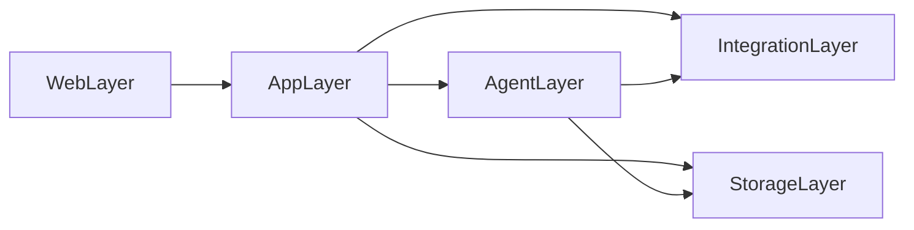
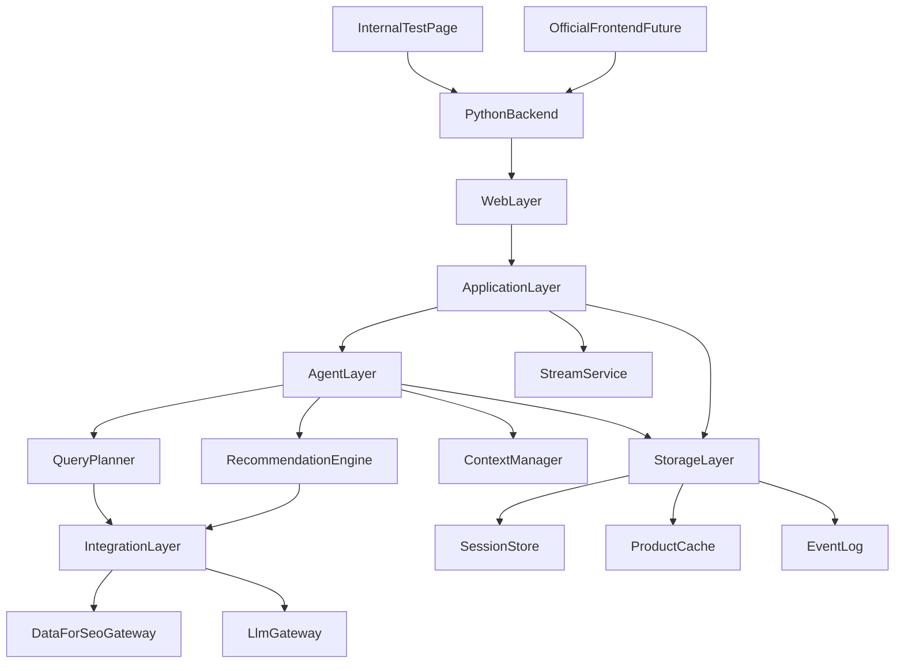
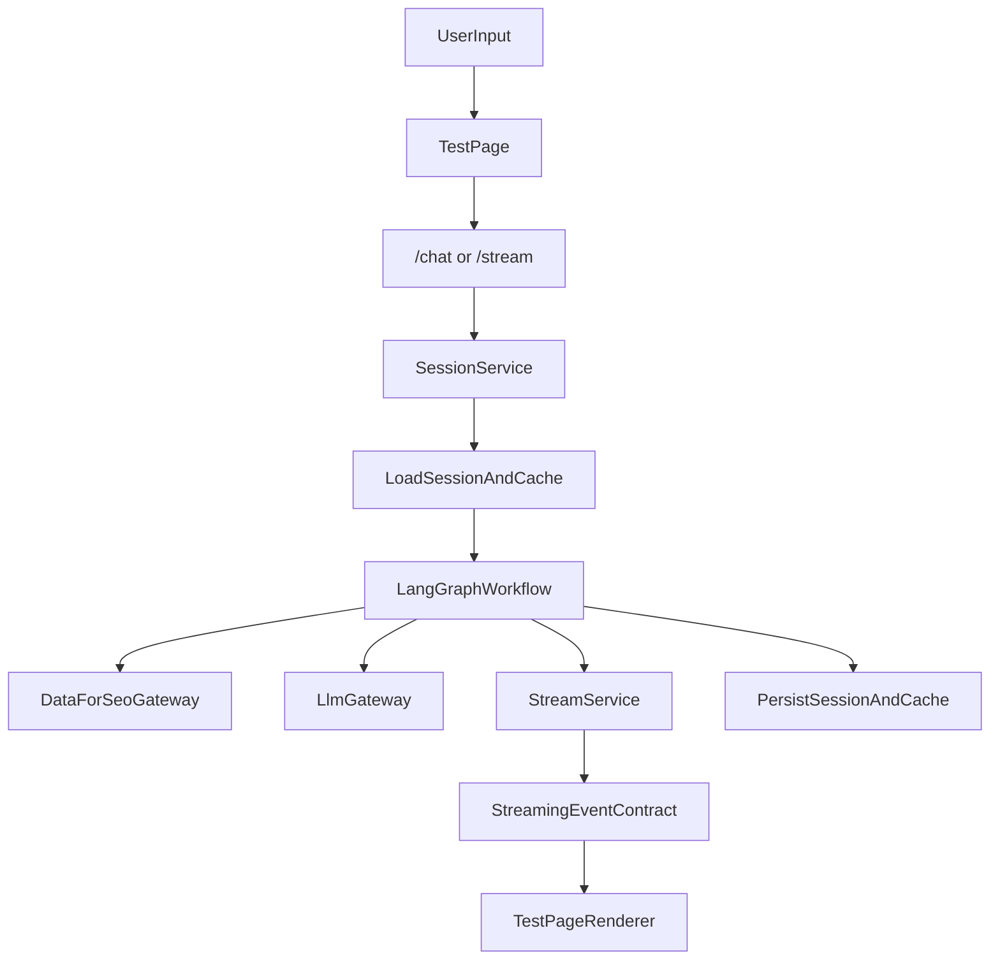

# 项目整体架构设计

## 1. 文档目标

本文档定义当前项目在 `MVP` 阶段的整体系统架构。

该文档的目标不是重复说明导购 Agent 内部推理流程，而是从项目级视角回答以下问题：

- 当前项目到底是什么，不是什么
- 整个系统由哪些层和模块组成
- 一个 Python 后端如何同时承载 API、Agent、流式输出、缓存和测试页
- 用户请求如何从测试页流转到 Agent，再以流式事件回到前端
- 后续正式前端接入时，如何平滑演进而不推翻现有设计

本文件与以下文档配套使用：

- [docs/shopping-agent-architecture.md](docs/shopping-agent-architecture.md)
- [docs/streaming-event-contract.md](docs/streaming-event-contract.md)

## 2. 项目定位

### 2.1 当前项目是什么

当前项目的定位是：

- 一个导购推荐后端
- 一个用于验证导购流程和流式 UI 的测试页面
- 一个面向后续正式业务前端接入的中台式后端原型

它的核心价值是先把这条链路跑通：

- 用户表达需求
- Agent 进行理解、搜索、筛选和推荐
- 系统以结构化流式方式返回候选、Top 3、对比表格和推荐理由

### 2.2 当前项目不是什么

在 `MVP` 阶段，这个项目不是：

- 完整电商网站
- 下单和支付系统
- 用户中心
- 后台运营平台
- 多租户平台
- 完整高并发生产系统

### 2.3 当前架构目标

当前架构应同时满足两个目标：

1. 足够简单，能尽快跑通一个可演示、可验证、可联调的版本。
2. 保留明确模块边界，后续正式前端接入或服务拆分时不需要重写核心逻辑。

## 3. MVP 部署形态

### 3.1 部署原则

`MVP` 采用“单个 Python 后端服务 + 内置前端测试页”的部署方式。

也就是说，同一个后端服务承载：

- 页面路由和测试页静态资源
- HTTP API
- 流式输出接口
- LangGraph Agent 运行时
- DataForSEO 接入
- 本地缓存
- 会话状态存储
- 调试日志与推荐快照

### 3.2 为什么先这样做

这样设计的原因是：

- 实现复杂度最低
- 联调成本最低
- 便于快速验证会话、缓存和流式交互
- 不需要在项目初期就引入多服务协调成本

### 3.3 后续演进前提

虽然当前只有一个后端进程或一个后端服务，但逻辑上必须分层。

也就是说，部署可以是单体，架构不能写成一团。

### 3.4 MVP 运行形态建议

为了让这套单后端方案更可落地，建议将运行形态进一步约束为：

- 一个 `ASGI` 应用作为统一入口
- 一个主 Web 进程同时承载页面路由、HTTP API 和 `SSE` 流式输出
- Agent 工作流与 Web 请求运行在同一服务内，但通过应用层解耦
- 本地状态优先使用轻量持久化，不引入额外中间件

在 `MVP` 阶段，推荐的最小运行模型是：

- Web 请求进入统一应用
- 应用层创建本轮 `request/session/turn`
- Agent 在同一进程内执行 LangGraph
- 流式服务把 Agent 中间结果写入当前流连接
- 会话状态和商品缓存写入本地存储

这样既能控制复杂度，也能保留后续拆分空间。

## 4. 系统边界

### 4.1 当前要做

`MVP` 当前需要覆盖的范围：

- 导购对话入口
- 多轮会话上下文管理
- 基于需求构建 query
- 通过 DataForSEO 获取候选商品
- 候选排序与 Top 3 推荐
- 补拉商品详情、卖家和评论
- 本地缓存复用
- 流式事件输出
- 测试页实时渲染候选卡片、Top 3、对比表格和推荐理由

### 4.2 当前不做

`MVP` 明确不做：

- 支付和订单链路
- 登录和复杂权限系统
- 正式前端工程体系
- 后台运营配置台
- 实时库存与交易一致性问题
- 分布式任务调度与大规模并发治理

### 4.3 后续预留

当前架构应为以下能力预留扩展空间：

- 正式前端接入
- 更稳定的持久化存储
- 更完整的鉴权
- 服务拆分
- 可观测性增强
- 更高并发下的异步执行和队列化

## 5. 总体分层

项目级视角下，建议将系统划分为五层。

### 5.1 Web Layer

负责：

- 暴露 HTTP 接口
- 提供流式响应入口
- 承载测试页静态资源和页面路由

这一层的职责是把浏览器请求接进来，再把结构化结果返回给浏览器，不直接承载核心导购逻辑。

### 5.2 Application Layer

负责：

- 管理会话入口
- 编排一次导购用例的业务步骤
- 调用 Agent
- 组织标准响应和流式事件

这一层是“系统用例层”，连接 Web 层和 Agent 层。

### 5.3 Agent Layer

负责：

- LangGraph 工作流
- Query 构建
- 候选评分
- Top 3 选择
- 细节补全
- 推荐解释生成

这一层直接对应导购智能体的核心能力，详细流程参见 [docs/shopping-agent-architecture.md](docs/shopping-agent-architecture.md)。

### 5.4 Integration Layer

负责：

- DataForSEO MCP / API 调用
- 模型调用封装
- 外部服务失败兜底
- 缓存读写适配

这一层的目标是把所有外部依赖收口，不让 Agent 或 Web 直接耦合第三方细节。

### 5.5 Storage Layer

负责：

- 会话状态
- 商品缓存
- 流式事件日志
- 推荐结果快照
- 调试工件

这层在 `MVP` 可以先使用本地文件或轻量本地数据库，但逻辑上仍应与业务层分离。

### 5.6 依赖方向约束

为了避免单体应用逐渐失控，建议从一开始明确依赖方向：

- `Web Layer` 只能依赖 `Application Layer`
- `Application Layer` 可以依赖 `Agent Layer`、`Integration Layer`、`Storage Layer`
- `Agent Layer` 可以依赖 `Integration Layer` 和 `Storage Layer`
- `Integration Layer` 不应依赖 `Web Layer`
- `Storage Layer` 不应依赖 `Web Layer` 或具体前端实现

可以把依赖关系理解为：



这条约束的价值在于：

- 测试页替换时不会影响 Agent
- DataForSEO 或模型接入替换时不会影响 Web 层
- 后续服务拆分时可以按层拆，而不是从乱耦合代码中硬拆

### 5.7 与 Agent 子架构的映射关系

需要特别说明：本文件中的 5 层是**项目级/系统级分层**，而 [docs/shopping-agent-architecture.md](docs/shopping-agent-architecture.md) 中的 7 层是**导购 Agent 子系统内部的运行时分层**。

两者不是同一抽象层级，因此不要求层数一致，也不应该强行一一对应。

可以这样理解：

| 项目级 5 层 | Agent 级 7 层 | 关系说明 |
| --- | --- | --- |
| `Web Layer` | `Interaction Layer` 的入口部分 | 承担页面路由、HTTP 接口、SSE 连接等外部交互入口 |
| `Application Layer` | `Interaction Layer` 的系统侧部分 + `Streaming Delivery Layer` 的编排部分 | 负责会话装载、请求编排、事件映射与响应组织 |
| `Agent Layer` | `Orchestration Layer` + `Reasoning Layer` | 对应 LangGraph 编排、LangChain 推理、候选评分、Top 3 选择与解释生成 |
| `Integration Layer` | `Tool Layer` | 统一封装 DataForSEO、模型调用及其他外部依赖 |
| `Storage Layer` | `Cache Layer` 的系统实现部分 | 管理会话状态、商品缓存、事件日志和调试工件 |
| 项目架构中视为外部依赖 | `Data Source Layer` | 在系统图里它属于系统外部数据源，不作为内部层单列 |

此外，`shopping-agent-architecture.md` 把 `Streaming Delivery Layer` 单独抽出，是因为它在 Agent 运行时中承担“中间结果如何增量送达前端”的职责；而在本项目级文档里，这一职责被拆分到：

- `Web Layer` 的流式连接承载能力
- `Application Layer` 的 `stream_service` 事件映射与发送能力

因此，两份文档应组合阅读：

- 本文档回答“整个项目如何组织”
- `shopping-agent-architecture.md` 回答“Agent 内部如何运行”
- `streaming-event-contract.md` 回答“前后端如何交换流式事件”

## 6. 项目级总体架构图



这张图表达的核心点是：

- 测试页和未来正式前端都只是客户端
- Python 后端是当前唯一部署单元
- 单体部署内部仍按职责分层
- Agent 不直接暴露给浏览器，而是通过应用层和流式服务间接提供能力

## 7. 单后端内部模块设计

虽然当前只部署一个后端，但建议从一开始就按照模块边界组织代码。

## 7.1 推荐模块拆分

建议的逻辑模块如下：

- `api.routes.chat`
- `api.routes.stream`
- `web.test_page`
- `application.chat_service`
- `application.stream_service`
- `application.session_service`
- `agent.graph`
- `agent.state`
- `agent.nodes.context_merge`
- `agent.nodes.intent_parse`
- `agent.nodes.query_build`
- `agent.nodes.local_cache_read`
- `agent.nodes.product_search`
- `agent.nodes.product_context_resolve`
- `agent.nodes.candidate_score`
- `agent.nodes.top3_select`
- `agent.nodes.stream_emitters`
- `agent.nodes.detail_fetch`
- `agent.nodes.cache_update`
- `agent.nodes.answer_generate`
- `agent.nodes.memory_update`
- `integrations.dataforseo`
- `integrations.llm`
- `storage.cache`
- `storage.session`
- `storage.artifacts`

### 7.2 模块职责说明

| 模块 | 职责 |
| --- | --- |
| `api.routes.chat` | 接收用户消息、创建或续用会话、返回基本响应元信息 |
| `api.routes.stream` | 建立流式连接并持续返回结构化事件 |
| `web.test_page` | 内置测试页面，用于联调和内部验证 |
| `application.chat_service` | 作为一次导购请求的业务入口 |
| `application.stream_service` | 将 Agent 中间结果转换成流式事件 |
| `application.session_service` | 统一管理 `session_id`、`turn_id` 和会话装载 |
| `agent.graph` | 定义 LangGraph 主流程 |
| `agent.state` | 定义 `AgentState` 和状态转换规则 |
| `agent.nodes.context_merge` | 合并当前输入与会话上下文 |
| `agent.nodes.intent_parse` | 判断当前请求是探索、细化、比较还是目标商品追问 |
| `agent.nodes.query_build` | 生成适合商品搜索的 query 与筛选条件 |
| `agent.nodes.local_cache_read` | 读取商品缓存、会话缓存和最近推荐结果 |
| `agent.nodes.product_search` | 调用 DataForSEO 获取候选商品 |
| `agent.nodes.product_context_resolve` | 解析候选商品上下文和字段可用性 |
| `agent.nodes.candidate_score` | 对候选商品进行相关性评分与排序 |
| `agent.nodes.top3_select` | 选择推荐 Top 3 |
| `agent.nodes.stream_emitters` | 统一承载 `StreamCandidates`、`StreamTop3`、`StreamEnrich` 三类流式发射点 |
| `agent.nodes.detail_fetch` | 获取商品详情、卖家、评论等补充字段 |
| `agent.nodes.cache_update` | 将候选与补充字段写回缓存 |
| `agent.nodes.answer_generate` | 生成导语、对比语义和推荐理由语义结果 |
| `agent.nodes.memory_update` | 更新会话状态、follow-up 目标和最近推荐结果 |
| `integrations.dataforseo` | 统一封装 DataForSEO MCP 与 API |
| `integrations.llm` | 统一封装模型调用与结构化输出 |
| `storage.cache` | 保存商品卡片、详情、卖家和评论快照 |
| `storage.session` | 保存会话上下文与最近推荐结果 |
| `storage.artifacts` | 保存流式事件日志、推荐快照和调试记录 |

### 7.3 运行时节点与实现模块的映射

这里需要明确区分两个概念：

- [docs/shopping-agent-architecture.md](docs/shopping-agent-architecture.md) 中定义的是**运行时工作流节点**
- 本文档这里定义的是**代码组织模块**

二者应该存在稳定映射，但不要求严格 1:1 一个节点对应一个文件。

在当前 `MVP` 架构下，建议映射如下：

| 运行时节点 | 建议实现模块 |
| --- | --- |
| `ContextMerge` | `agent.nodes.context_merge` |
| `IntentParse` | `agent.nodes.intent_parse` |
| `QueryBuild` | `agent.nodes.query_build` |
| `LocalCacheRead` | `agent.nodes.local_cache_read` |
| `ProductSearch` | `agent.nodes.product_search` |
| `ProductContextResolve` | `agent.nodes.product_context_resolve` |
| `CandidateScore` | `agent.nodes.candidate_score` |
| `Top3Select` | `agent.nodes.top3_select` |
| `StreamCandidates` | `agent.nodes.stream_emitters` |
| `StreamTop3` | `agent.nodes.stream_emitters` |
| `StreamEnrich` | `agent.nodes.stream_emitters` |
| `DetailFetch` | `agent.nodes.detail_fetch` |
| `CacheUpdate` | `agent.nodes.cache_update` |
| `AnswerGenerate` | `agent.nodes.answer_generate` |
| `MemoryUpdate` | `agent.nodes.memory_update` |

这张映射表的含义是：

- 节点语义必须完整覆盖
- 代码组织可以做适度分组
- 当前最适合分组的就是三个流式发射点，它们统一落在 `stream_emitters` 模块

### 7.4 建议目录形态

下面是一个适合 `MVP` 的逻辑目录结构示意：

```text
app/
  api/
    routes/
      chat.py
      stream.py
  web/
    test_page/
  application/
    chat_service.py
    stream_service.py
    session_service.py
  agent/
    graph.py
    state.py
    nodes/
      context_merge.py
      intent_parse.py
      query_build.py
      local_cache_read.py
      product_search.py
      product_context_resolve.py
      candidate_score.py
      top3_select.py
      stream_emitters.py
      detail_fetch.py
      cache_update.py
      answer_generate.py
      memory_update.py
  integrations/
    dataforseo.py
    llm.py
  storage/
    cache.py
    session.py
    artifacts.py
  domain/
    models.py
    events.py
```

这只是逻辑建议，不要求当前立刻生成代码，但整体架构文档应按这个边界理解。

### 7.5 关键运行时组件

如果继续细化到“系统运行时”，建议把单后端内部再看成以下组件：

| 组件 | 所在层 | 作用 |
| --- | --- | --- |
| `HttpController` | Web | 处理普通 HTTP 请求与参数校验 |
| `SseController` | Web | 管理 `SSE` 连接建立、心跳与关闭 |
| `ChatService` | Application | 管理一次导购请求的业务入口 |
| `SessionService` | Application | 负责会话装载、续用和回写 |
| `StreamService` | Application | 把中间结果映射为流式事件 |
| `LangGraphRunner` | Agent | 执行工作流并产出阶段性结果 |
| `RecommendationEngine` | Agent | 负责候选评分、Top 3 选择和理由生成 |
| `DataForSeoGateway` | Integration | 统一调用 `Products`、`Product Info`、`Sellers`、`Reviews` |
| `LlmGateway` | Integration | 统一模型调用与结构化输出 |
| `SessionStore` | Storage | 存储多轮会话状态 |
| `ProductCacheStore` | Storage | 存储商品卡片和详情快照 |
| `EventArtifactStore` | Storage | 存储流式事件日志和调试工件 |

### 7.6 模块间协作规则

单后端不代表所有模块互相直连，建议遵守以下协作规则：

- 路由层不直接调用 `DataForSEO`
- 路由层不直接读写底层缓存文件
- Agent 节点不直接操作前端事件格式
- `StreamService` 负责把 Agent 输出翻译为 [docs/streaming-event-contract.md](docs/streaming-event-contract.md) 中定义的事件
- `SessionService` 负责统一处理会话状态装载和落盘
- `DataForSeoGateway` 负责屏蔽 `MCP` 与 HTTP API 的差异

这里要特别说明：

- Agent 图内部可以存在“流式阶段节点”或“结果发射点”
- 这些节点可以产出候选结果、Top 3 结果和补全结果
- 但这些结果在进入前端之前，必须先经过 `StreamService` 映射为标准事件

也就是说，Agent 可以决定“什么时候可以发出一批结果”，但不能决定“前端事件长什么样”。

这能确保：

- Agent 关注推荐逻辑
- 流式协议关注 UI 交互
- 集成层关注外部服务适配
- 存储层关注落盘和读取

## 8. 核心请求链路

项目最核心的是从测试页发起请求，到后端流式返回完整推荐过程。

### 8.1 端到端链路

1. 用户在测试页输入导购需求。
2. Web 层接收请求，并交给 `chat_service`。
3. `session_service` 创建或续用 `session_id` 与 `turn_id`。
4. 应用层读取会话状态与本地缓存。
5. Agent 层执行 LangGraph 工作流。
6. Agent 调用 DataForSEO 和模型能力完成搜索、筛选、推荐和补全。
7. 应用层将中间结果映射为流式事件。
8. Web 层把流式事件持续推送给测试页。
9. 测试页根据事件更新候选卡片、Top 3、对比表格和推荐理由。

### 8.2 请求链路图



### 8.3 与已有文档的关系

在整体架构中：

- [docs/shopping-agent-architecture.md](docs/shopping-agent-architecture.md) 负责定义 Agent 内部推理流程
- [docs/streaming-event-contract.md](docs/streaming-event-contract.md) 负责定义前后端流式协议
- 本文档负责定义整个系统如何把这两者装配起来

### 8.4 请求类型拆分

为了避免“一个接口什么都做”，建议在整体架构上把请求拆成两类：

#### 控制类请求

用于：

- 创建或续用会话
- 发起一次新的推荐任务
- 获取同步元信息

这类请求通常是普通 HTTP 接口。

#### 结果类请求

用于：

- 建立流式连接
- 接收候选卡片
- 接收 Top 3
- 接收商品 patch
- 接收对比表更新

这类请求建议走 `SSE`。

这种拆分的意义是：

- 控制流和结果流分开
- 请求失败与流式中断更容易定位
- 将来正式前端接入时更容易适配

## 9. 状态、缓存与存储组织

从系统视角，建议把状态区分为三个 scope。

### 9.1 Request Scope

表示单次请求上下文，典型内容包括：

- `request_id`
- `session_id`
- `turn_id`
- 当前 trace 信息
- 当前流式连接状态

这个 scope 生命周期最短，只在本次请求或流式连接中有效。

### 9.2 Session Scope

表示多轮导购会话上下文，典型内容包括：

- 用户需求摘要
- 硬条件和软偏好
- 已提及商品
- 最近一次推荐结果
- 当前 follow-up 目标商品

这部分对应会话连续性，优先为“记住用户在聊什么”服务。

### 9.3 Local Cache Scope

表示商品级缓存，典型内容包括：

- 候选商品卡片
- 图片信息
- 详情快照
- 卖家与价格快照
- 评论摘要
- 字段新鲜度

这部分优先为“复用商品数据”服务，而不是记录会话语义。

### 9.4 Event Log Scope

建议单独保存流式事件日志，供调试和回放使用。

保存事件日志的价值包括：

- 回放测试页渲染问题
- 排查事件顺序问题
- 分析某次推荐为什么输出了某些卡片或理由

### 9.5 存储原则

- 会话状态和商品缓存分开管理
- 商品缓存和事件日志分开管理
- 不让测试页直接读取底层缓存文件
- 所有状态读写统一走存储层服务

### 9.6 MVP 存储实现建议

从工程可落地角度，`MVP` 可以直接采用以下实现组合：

| 数据类型 | 建议实现 |
| --- | --- |
| 会话状态 | `SQLite` 或轻量本地数据库 |
| 商品缓存 | 本地数据库表或本地文件缓存 |
| 事件日志 | JSONL 文件或本地数据库事件表 |
| 推荐快照 | 本地文件或数据库记录 |

推荐原因：

- `SQLite` 足够支持单机 `MVP`
- 易于调试和备份
- 不需要额外部署 Redis、Postgres 等基础设施

但逻辑接口层面仍建议保留：

- `SessionRepository`
- `ProductCacheRepository`
- `EventLogRepository`

这样后续替换底层实现时，上层不需要大改。

## 10. 流式输出在整体架构中的位置

流式输出不是一个附加能力，而是当前 `MVP` 的核心体验层。

### 10.1 建议的流式实现

在 `MVP` 阶段，建议固定采用一种更简单的单向流式方案，例如 `SSE`。

原因是：

- 当前主要是后端向前端单向推送事件
- 实现复杂度低
- 浏览器支持友好
- 与结构化事件 contract 非常匹配

如果未来需要更复杂的双向控制，再考虑 `WebSocket`。

### 10.2 流式服务职责

`application.stream_service` 应承担以下职责：

- 接收 Agent 中间结果
- 按事件协议封装为标准 event envelope
- 保证事件顺序
- 将事件推送到 Web 层
- 必要时写入事件日志

在实现上，`StreamService` 可以消费两类输入：

- Agent 最终结果
- Agent 在执行过程中的阶段性输出或发射信号

但无论输入来自哪一类，前端看到的都必须是统一 contract 下的事件，而不是 Agent 私有结构。

### 10.3 即时推送原则

这里需要明确一条强约束：

- `StreamService` 不应等待整个 Agent 工作流完成后再统一输出
- 只要某个阶段已经产出可展示结果，就应立即映射成事件并推送到前端

具体来说：

- `Products` 阶段一旦拿到候选卡片，就立即发送 `candidate_card`
- `Top 3` 一旦确定，就立即发送导语和 `top3_card`
- 任一商品的 `Product Info`、`Sellers`、`Reviews` 只要先返回，就立即发送对应的 `product_patch`、`comparison_table_patch` 或 `reason_patch`

因此，`StreamService` 的角色不是“最终汇总器”，而是“阶段结果的即时转发器”。

### 10.4 为什么流式服务单独成层

这样做的原因是：

- Agent 不需要关心浏览器怎么渲染
- 前端不需要理解 LangGraph 内部节点
- 协议演进只需调整 stream mapping 层，不影响核心推荐逻辑

### 10.5 流式连接生命周期

从系统实现角度，建议明确一条流式连接的生命周期：

1. 前端先发起控制请求，拿到 `session_id`、`turn_id` 或推荐任务上下文。
2. 前端建立 `SSE` 连接。
3. 后端开始执行 Agent 工作流。
4. `StreamService` 在各阶段结果产出后立即按顺序发送 `status`、`candidate_card`、`top3_card`、`product_patch` 等事件。
5. 当推荐完成或失败时，发送 `stream_done` 或 `error`。
6. 后端关闭或结束本轮流式连接。

这里建议明确两个要求：

- 每轮流式推荐都要有唯一 `stream_id`
- 每个事件都要有递增 `seq`

这样测试页和未来正式前端都能稳定处理乱序、重连和调试问题。

## 11. 测试页在系统中的定位

测试页不是未来正式产品前端，而是当前系统的内部客户端。

### 11.1 测试页职责

测试页应承担：

- 发起导购请求
- 建立流式连接
- 展示候选卡片、Top 3、对比表格和推荐理由
- 展示事件流和基础调试信息
- 验证会话上下文与本地缓存是否生效

### 11.2 测试页不应承担的职责

测试页不应直接承担：

- 业务判断逻辑
- 商品排序逻辑
- 推荐理由生成逻辑
- 数据聚合逻辑

这些都必须留在后端。

### 11.3 测试页存在的意义

测试页的价值是：

- 降低联调成本
- 验证事件协议
- 验证多轮上下文
- 验证缓存复用
- 为后续正式前端提供一个行为参考客户端

## 12. 对外接口视角

从未来正式前端接入角度看，后端应尽量收敛为少量稳定接口。

### 12.1 推荐接口类型

建议最少包含：

- 会话创建或续用入口
- 导购请求入口
- 流式推荐输出入口
- 调试或健康检查入口

### 12.2 接口设计原则

- 正式前端和测试页都调用同一套核心接口
- 不为测试页定制独占协议
- 流式返回严格遵循 [docs/streaming-event-contract.md](docs/streaming-event-contract.md)

### 12.3 建议接口草案

在 `MVP` 阶段，可以先收敛为一组最小接口：

| 方法 | 路径 | 用途 |
| --- | --- | --- |
| `POST` | `/api/sessions` | 创建新会话或返回可续用会话 |
| `POST` | `/api/chat` | 提交一轮导购输入，返回 `session_id`、`turn_id` 等元信息 |
| `GET` | `/api/stream` | 建立 `SSE` 连接，流式接收推荐事件 |
| `GET` | `/healthz` | 健康检查 |
| `GET` | `/` | 打开内置测试页 |

其中建议的职责划分是：

- `/api/chat` 负责“启动本轮推荐”
- `/api/stream` 负责“消费本轮推荐结果”

这样未来正式前端接入时，不需要依赖测试页内部实现。

### 12.4 接口与会话关系

建议明确以下关系：

- 一个 `session_id` 对应一段多轮导购会话
- 一个 `turn_id` 对应一次用户输入触发的推荐轮次
- 一个 `stream_id` 对应本轮推荐输出流

推荐关系如下：

- `session_id` 负责记住上下文
- `turn_id` 负责区分每轮输入
- `stream_id` 负责区分具体事件流

## 13. 技术决策与非功能要求

### 13.1 MVP 技术决策

当前建议的核心技术取向：

- Python 单后端
- ASGI 风格 Web 服务
- LangGraph 作为工作流编排
- LangChain 作为模型和工具封装
- DataForSEO MCP 优先
- 本地缓存优先
- `SSE` 作为默认流式输出方案

### 13.2 非功能要求

即使是 `MVP`，也建议坚持以下要求：

- 推荐结果必须可追溯到外部数据来源
- 流式事件必须可记录和排查
- 模块边界应清晰，避免后期拆分困难
- 会话状态与商品缓存不能混为一谈
- 前端渲染不应反向耦合 Agent 内部实现

### 13.3 配置与环境变量边界

即使当前不写代码，整体架构也应提前定义配置边界。

建议至少区分以下配置：

- 模型配置
- DataForSEO 凭证配置
- 缓存路径配置
- 事件日志路径配置
- 流式输出开关与超时配置

这些配置应统一由配置层注入，而不是散落在各模块内部。

### 13.4 MVP 最小可观测性

`MVP` 不必一开始就上完整 observability 平台，但至少建议记录：

- `request_id`
- `session_id`
- `turn_id`
- `stream_id`
- 关键节点耗时
- 外部调用失败信息

这样在排查问题时，至少能回答：

- 这轮推荐是否真的发起了
- Agent 卡在哪个阶段
- 哪次 DataForSEO 或模型调用失败了
- 前端为什么没收到完整事件流

## 14. 从测试页到正式前端的演进路径

当前系统的一个核心目标，是未来可以平滑接入正式前端。

### 14.1 当前阶段

当前形态是：

- 内置测试页
- 单个 Python 后端
- 测试页通过同一服务内的页面路由访问

### 14.2 下一阶段

当正式前端准备好后：

- 保持后端 API 不变
- 保持流式事件 contract 不变
- 将测试页视为内部参考客户端
- 正式前端实现同一套事件消费和渲染

### 14.3 再下一阶段

如果流量、团队分工或维护复杂度上升，可以进一步演进为：

- 前后端独立部署
- 后端保留当前 API 和 Agent 核心
- 流式服务独立优化
- 视需要拆出独立 Agent runtime 或 worker

### 14.4 演进的核心原则

后续演进时优先保证这三点稳定：

- 接口稳定
- 事件 contract 稳定
- Agent 业务语义稳定

只要这三点稳定，测试页替换为正式前端的成本就会很低。

## 15. MVP 实施优先级

如果后续进入实现阶段，建议优先顺序如下：

1. 搭出单后端骨架和测试页入口
2. 接通会话管理和本地缓存
3. 接入 LangGraph 主工作流
4. 打通 DataForSEO 搜索和补全链路
5. 打通流式事件输出
6. 在测试页完成卡片、表格和理由渲染
7. 增加事件日志和调试能力

## 16. 总结

当前项目的最佳形态不是一开始就做成多服务系统，而是：

- 用一个 Python 后端先把导购核心链路跑通
- 用内置测试页验证流式 UI、缓存、多轮上下文和推荐效果
- 在单体部署下保持清晰的层次和模块边界
- 为未来正式前端接入保留稳定 API 和流式协议

这样既能满足 `MVP` 的速度要求，也不会把未来演进路径堵死。
