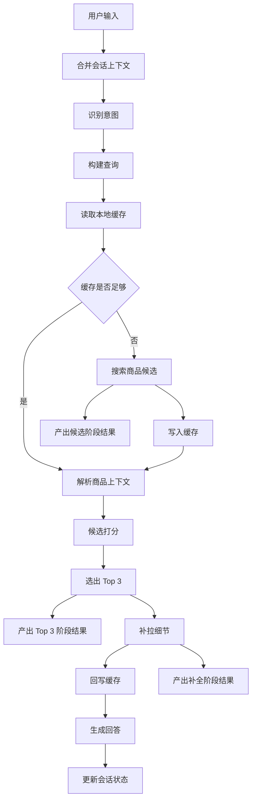

# 导购 Agent 整体架构文档

## 1. 文档目标

本文档定义一个基于 `LangGraph + LangChain + DataForSEO` 的导购 Agent 整体方案。

该 Agent 的目标是：

- 接收用户对商品的自然语言需求
- 将需求转化为适合搜索的 query 与筛选条件
- 通过 `DataForSEO MCP` 或直连 API 获取商品候选数据
- 结合用户需求对候选商品进行比较、筛选与推荐
- 生成结构化的推荐结果，包括商品卡片、对比表格和推荐理由
- 支持多轮对话，在一次导购会话中持续复用用户偏好与已获取的商品信息

本文档只描述架构、状态、流程与输出协议，不包含具体代码实现。

## 2. 设计原则

### 2.1 先检索，后推荐

Agent 不直接凭模型常识推荐商品，而是必须先从外部数据源获取候选商品，再基于事实数据做推荐。

### 2.2 会话上下文直接使用

用户在历轮对话中表达的预算、用途、品牌偏好、尺寸要求、排斥条件、性能重点等，直接作为下一轮 query 构建的输入。

### 2.3 商品上下文轻量化

不把所有商品详情塞进上下文，而是只保留：

- 用户看过哪些商品
- 这些商品的轻量索引信息
- 当前已加载了哪些字段
- 还可以补拉哪些字段

### 2.4 本地缓存优先

已获取过的商品卡片、详情、卖家、评论、价格摘要等内容写入本地缓存。后续轮次优先命中缓存，仅在缓存缺失、字段不够或数据过旧时才重新调用外部接口。

### 2.5 推荐过程可解释

每个推荐结果都应明确说明：

- 为什么入选 Top 3
- 它匹配了用户哪些条件
- 它与其他商品相比的优点和权衡点

### 2.6 渐进式流式输出

导购结果不应等所有字段全部拉齐后再一次性返回。

更合理的方式是分阶段流式输出：

- `Products` 返回后，先把候选商品卡片流式推给前端
- 完成初步打分并确定 `Top 3` 后，优先展示 Top 3 卡片
- 随后按商品逐步补拉 `Product Info`、`Sellers`、`Reviews`
- 每拿到一类新字段，就增量更新商品卡片和对比表格

这样可以兼顾首屏速度与信息完整度，让用户先看到候选，再看到不断补全的商品细节。

这里的关键不是“分几段发”，而是“哪一段先准备好，就先发哪一段”。

也就是说：

- 不等待所有候选评分、Top 3、详情、卖家、评论全部结束
- 任一阶段只要已经形成可展示结果，就立刻进入系统侧流式发送
- 后续阶段继续以 patch 方式补充，而不是回到最后统一汇总

## 3. 目标用户流程

系统主要支持三类典型场景：

### 3.1 模糊探索

用户输入的是模糊需求，例如：

- “想买个适合通勤的轻薄笔记本”
- “帮我看看适合学生党的无线耳机”

此时 Agent 的目标是抽取核心需求并生成 `discovery_query`，获取一批候选商品。

### 3.2 条件细化

用户在上一轮基础上继续补充条件，例如：

- “预算 6000 以内”
- “最好 14 寸”
- “更偏向联想和华硕”

此时 Agent 不应只用当前轮输入，而应将当前条件与历史会话上下文合并，生成 `refinement_query`。

### 3.3 指向商品追问

用户开始围绕某个候选商品追问，例如：

- “刚才那个戴尔的续航怎么样”
- “把第一个和第三个再对比一下”
- “这个商品还有别的平台价格吗”

此时 Agent 应先从会话状态与本地缓存中定位目标商品，再决定是否补拉 `Product Info`、`Sellers`、`Reviews` 等字段，生成 `targeted_query` 或直接从缓存补充上下文。

## 4. 总体架构

### 4.1 组件分层

整体架构分为七层：

1. `Interaction Layer`
   负责接收用户输入、返回推荐结果、维护会话边界。
2. `Orchestration Layer`
   由 `LangGraph` 负责节点编排、状态流转、条件分支与会话续接。
3. `Reasoning Layer`
   由 `LangChain` 负责提示词、结构化输出、候选评分、推荐解释与结果格式化。
4. `Tool Layer`
   对 `DataForSEO MCP` 与兜底 API 进行统一抽象，提供稳定的业务工具接口。
5. `Cache Layer`
   管理本地缓存，用于复用商品卡片、详情、价格摘要和字段可用性。
6. `Streaming Delivery Layer`
   负责把阶段性结果流式发送到前端，并驱动前端做增量渲染。
7. `Data Source Layer`
   主要是 `DataForSEO Merchant Google Shopping` 相关能力。

#### 4.1.1 与项目整体架构的关系

这里的 7 层是**导购 Agent 子系统内部的运行时分层**，不是整个项目的系统级分层。

也就是说，本文件回答的是：

- Agent 内部如何接收输入
- 如何编排工作流
- 如何调用工具
- 如何管理缓存
- 如何把中间结果流式输出

而 [docs/project-architecture.md](docs/project-architecture.md) 中定义的 5 层回答的是：

- 整个项目如何组织
- 单后端服务内部如何分层
- 测试页、API、Agent、存储之间如何协作

两者之间的关系可以理解为：

| Agent 级 7 层 | 项目级 5 层 | 关系说明 |
| --- | --- | --- |
| `Interaction Layer` | `Web Layer` + `Application Layer` | 既包含面向用户的输入输出边界，也包含系统侧对一次请求的组织 |
| `Orchestration Layer` | `Agent Layer` | 对应 LangGraph 的节点编排与状态推进 |
| `Reasoning Layer` | `Agent Layer` | 对应 LangChain 推理、候选评分、推荐解释与结构化输出 |
| `Tool Layer` | `Integration Layer` | 负责把 DataForSEO、模型和其他依赖统一封装为可调用能力 |
| `Cache Layer` | `Storage Layer` | 对应商品缓存、会话相关缓存和状态落盘机制 |
| `Streaming Delivery Layer` | `Application Layer` + `Web Layer` | 在项目级架构里由 `stream_service` 和流式接口共同承载 |
| `Data Source Layer` | 项目级架构中的外部依赖 | 在系统架构里被视为外部数据源，不属于内部层 |

因此，阅读顺序建议是：

1. 先看 [docs/project-architecture.md](docs/project-architecture.md)，理解整个系统怎么组织
2. 再看本文件，理解 Agent 子系统内部怎么运转
3. 最后看 [docs/streaming-event-contract.md](docs/streaming-event-contract.md)，理解流式事件如何送到前端

### 4.2 主流程图

### 4.3 节点职责

| 节点 | 作用 |
| --- | --- |
| `ContextMerge` | 合并当前轮输入与历史偏好、约束、意图、已提及商品 |
| `IntentParse` | 判断当前是模糊探索、条件细化、目标商品追问还是比较请求 |
| `QueryBuild` | 基于上下文生成适合 `Products` 的 query 与筛选参数 |
| `LocalCacheRead` | 优先检查本地缓存中是否已有足够商品信息 |
| `ProductSearch` | 调用 `DataForSEO` 获取候选商品列表 |
| `StreamCandidates` | 在候选商品返回后产出候选阶段结果，交给系统侧流式服务做事件映射 |
| `ProductContextResolve` | 告诉模型当前看过哪些商品、每个商品有哪些可用字段 |
| `CandidateScore` | 基于用户需求对候选结果做相关性评分与排序 |
| `Top3Select` | 选出最适合推荐的 3 个商品 |
| `StreamTop3` | 在 Top 3 确定后产出推荐阶段结果，供系统侧生成导语和卡片事件 |
| `DetailFetch` | 对 Top 3 补拉图片、卖家、价格、评论、规格等字段 |
| `StreamEnrich` | 在字段补全过程中产出补全结果，供系统侧生成 patch 事件 |
| `CacheUpdate` | 将新增的候选卡片与详情快照写入本地缓存 |
| `AnswerGenerate` | 生成导语、商品卡片、对比表格与推荐理由 |
| `MemoryUpdate` | 更新会话状态、商品索引与缓存引用 |

#### 4.3.1 流式节点的归属说明

这里的 `StreamCandidates`、`StreamTop3`、`StreamEnrich` 仍然属于 Agent 工作流节点，但它们的职责是：

- 标记当前已经进入哪个流式阶段
- 把候选结果、Top 3 结果或补全结果写入 `stream_state`
- 产出供系统消费的中间结果或领域级流式信号

它们**不直接负责生成前端事件 envelope**，也**不直接操作** [docs/streaming-event-contract.md](docs/streaming-event-contract.md) 中定义的事件格式。

真正的职责边界是：

- Agent 节点负责“何时可以发、发什么语义内容”
- 项目级 `StreamService` 负责“把这些中间结果翻译成 SSE 事件、按 contract 发给前端”

因此，本文件中所谓“流式阶段节点”应理解为 Agent 内部的发射点，而不是前端协议层本身。

#### 4.3.2 节点与实现模块的关系

本文件中的 `ContextMerge`、`IntentParse`、`ProductSearch`、`DetailFetch` 等名称，首先表示**运行时工作流节点**，不等同于代码文件名。

实现时应满足两点：

- 每个运行时节点都要在代码层有明确归属
- 代码层可以适度分组，不要求严格 1:1 一个节点对应一个文件

例如：

- `StreamCandidates`、`StreamTop3`、`StreamEnrich` 可以统一归到一个 `stream_emitters` 模块
- 但不能只保留少量过粗的模块，导致运行时节点在实现层没有明确落点

项目级的实现模块划分和节点映射以 [docs/project-architecture.md](docs/project-architecture.md) 中的“运行时节点与实现模块的映射”小节为准。

## 5. 状态模型设计

### 5.1 AgentState 核心字段

建议的 `AgentState` 至少包含以下字段：

| 字段 | 说明 |
| --- | --- |
| `messages` | 原始多轮消息记录 |
| `session_summary` | 当前会话的压缩总结 |
| `user_requirements` | 用户需求对象，包含用途、预算、品牌偏好等 |
| `hard_constraints` | 硬条件，例如预算上限、尺寸、平台、系统要求 |
| `soft_preferences` | 软偏好，例如品牌倾向、颜值、重量、性价比 |
| `mentioned_products` | 用户在会话中点名或暗指过的商品引用 |
| `last_query` | 上一轮已执行的查询 |
| `product_catalog` | 轻量商品索引 |
| `product_field_registry` | 每个商品已加载和可加载的字段记录 |
| `cache_refs` | 会话状态与本地缓存之间的映射 |
| `recommended_products` | 最近一轮推荐出的 Top 3 |
| `followup_target_product` | 当前追问的目标商品 |
| `stream_state` | 当前流式输出阶段、已发送事件、待补全字段 |

### 5.2 会话上下文

会话上下文是下一轮 query 构建的直接输入，主要包括：

- 预算
- 核心用途
- 关键功能诉求
- 品牌偏好
- 排斥条件
- 已经确认过的选择倾向

例如：

- 第一轮用户说“适合通勤的轻薄笔记本”
- 第二轮用户说“预算 6000 以内，最好 14 寸”

则下一轮 query 不能只看“预算 6000 以内，最好 14 寸”，而应组合为完整需求：

- 通勤场景
- 轻薄诉求
- 预算 6000 以内
- 14 寸优先

### 5.3 商品上下文

商品上下文不应保存完整详情，而应以索引方式存在。

#### `product_catalog`

只保存轻量信息，例如：

- `product_ref`
- `title`
- `brand`
- `platform`
- `price_summary`
- `source_endpoint`
- `last_seen_turn`

#### `product_field_registry`

记录每个商品当前有哪些字段：

- `basic_card`
- `thumbnail`
- `product_info`
- `sellers`
- `reviews`
- `price_snapshot`

同时记录这些字段的状态：

- 已加载
- 未加载
- 已过期
- 可刷新

### 5.4 缓存映射

`cache_refs` 用于把会话内商品引用和本地缓存关联起来，例如：

- 缓存键
- 更新时间
- 数据来源
- 新鲜度标签
- 可复用字段列表

这样用户后续说“刚才那个戴尔”“第一个便宜点的那个”“上一个联想”时，Agent 可以通过：

1. `mentioned_products`
2. `product_catalog`
3. `cache_refs`

快速定位目标商品，而不是重新依赖自然语言猜测。

### 5.5 流式状态

`stream_state` 用于协调后端工作流和系统侧流式服务之间的阶段状态，前端渐进式渲染通过 `StreamService` 映射后的事件来驱动。建议包括：

- 当前阶段，例如 `searching`、`candidate_ready`、`top3_ready`、`enriching`、`completed`
- 已发送的商品卡片 ID
- 每个商品待补全的字段列表
- 当前对比表格是否为草稿版或最终版
- 是否还存在未完成的字段拉取任务

这样系统侧可以根据阶段变化稳定地产生事件，前端再根据这些事件做增量更新，而不是等后端一次性吐完整结果。

## 6. 本地缓存策略

### 6.1 缓存目标

本地缓存用于降低重复查询成本，并让多轮导购对话中已出现的商品持续可用。

缓存内容包括：

- 候选商品卡片
- 商品图片信息
- 商品详情摘要
- 卖家与价格快照
- 评论摘要
- 字段可用性信息

### 6.2 缓存使用原则

- 先读缓存，再查外部
- 先补缺字段，不做全量重查
- 同一推荐会话中，缓存内容持续可用
- 当用户切换到新的商品任务时，可开启新的推荐上下文

### 6.3 缓存生命周期

缓存建议分为两类：

- `session_cache`
  与当前会话强绑定，用于短期多轮追问
- `local_product_cache`
  与商品引用绑定，用于跨轮甚至跨会话复用

### 6.4 失效策略

当出现以下情况时触发刷新：

- 价格信息过旧
- 商品字段不完整
- 用户明确要求最新价格或最新卖家信息
- 当前缓存不足以支持比较和推荐

## 7. DataForSEO 数据获取分层

### 7.1 接入策略

默认使用 `DataForSEO MCP`，同时保留直连 HTTP API 的兜底方案。

业务层不直接耦合某个具体端点，而是统一通过工具层调用。

### 7.2 建议工具抽象

| 工具 | 作用 |
| --- | --- |
| `search_products(query, locale, filters)` | 搜索候选商品 |
| `get_product_info(product_ref)` | 获取商品详情、规格、图片等 |
| `get_product_sellers(product_ref)` | 获取卖家与价格差异 |
| `get_product_reviews(product_ref)` | 获取评论与口碑依据 |
| `load_cached_product_context(product_ref)` | 从本地缓存取已有商品上下文 |
| `persist_product_context(product_ref, payload)` | 将商品上下文写入本地缓存 |

### 7.3 端点角色划分

| DataForSEO 能力 | 用途 |
| --- | --- |
| `Products` | 搜候选、建立商品索引、获取基础卡片信息 |
| `Product Info` | 按需补细节，尤其是规格、图片、变体、卖点 |
| `Sellers` | 按需补价格、平台、卖家差异 |
| `Reviews` | 按需补评论依据与用户反馈 |

### 7.4 数据流策略

推荐链路采用如下数据流：

1. 优先读取本地缓存
2. 若缓存不足，调用 `Products` 获取候选列表
3. 将候选列表写入 `product_catalog` 与缓存
4. 立刻把候选卡片流式返回给前端
5. 对候选列表打分并选出 Top 3
6. 只要 Top 3 一确定，就立即将 Top 3 卡片与简短导语流式返回给前端
7. 对 Top 3 调用 `Product Info`、`Sellers`、`Reviews` 做按需补全
8. 每获取一批新字段，就立即增量更新前端卡片和对比表格
9. 将新获取字段回写缓存
10. 基于已验证的数据生成最终完整结果

### 7.5 流式输出分段

建议把导购输出拆成三个阶段：

#### 阶段一：候选阶段

来源主要是 `Products`。

这个阶段可先推送：

- 搜索命中的候选商品基础卡片
- 基础价格
- 基础图片
- 平台或来源

目的不是一次性完成推荐，而是尽快让前端有首屏内容。

#### 阶段二：推荐阶段

在候选打分完成后，推送：

- 简短导语
- `Top 3` 商品卡片
- 初版推荐标签
- 初版对比表格

这个阶段已经可以让用户开始判断方向。

#### 阶段三：补全阶段

在 `Product Info`、`Sellers`、`Reviews` 返回后，逐步补充：

- 更完整的价格信息
- 更多平台或卖家信息
- 关键规格和卖点
- 评论摘要
- 更完整的推荐理由

此阶段应采用增量更新，而不是覆盖整个页面。

如果三个商品的补全速度不同，也不应等待最慢的商品：

- 哪个商品先补到 `product_info`，就先更新哪个商品
- 哪个商品先拿到 `sellers`，就先补哪个商品的价格和平台
- 哪个商品先拿到 `reviews`，就先补哪个商品的口碑摘要

## 8. Query 构建策略

### 8.1 Query 组成来源

Query 不是简单改写用户一句话，而是由多个来源拼装：

- 当前轮用户表达
- 历史硬条件
- 历史软偏好
- 已提及商品线索
- 平台筛选与价格筛选
- 是否为比较或追问任务

### 8.2 Query 类型

### `discovery_query`

用于模糊探索，目标是尽快找出一批方向正确的候选。

例如用户说：

- “帮我找适合学生党的无线耳机”

系统应提炼为：

- 学生党
- 性价比优先
- 无线耳机

### `refinement_query`

用于在已有需求上继续细化。

例如：

- “预算 500 以内”
- “不要入耳式”
- “更看重续航”

这类输入应叠加到上一轮约束之上。

### `targeted_query`

用于围绕具体商品追问。

例如：

- “刚才那个索尼的佩戴舒适度怎么样”
- “把第一个的多平台价格给我”

这时优先使用商品引用、缓存字段和已获取详情，而不是重新做泛搜索。

### 8.3 Query 构建规则

1. 先判断当前轮是补条件还是换任务。
2. 若是补条件，将当前输入合并到历史约束中。
3. 若提到了具体商品，优先将该商品引用作为 query 上下文锚点。
4. 若缓存已足够支撑回答，则不再生成新的外部查询。
5. 若需要补全字段，只生成针对该字段的最小查询。

## 9. 推荐决策机制

### 9.1 推荐主逻辑

推荐不是一步完成，而是分为四个阶段：

1. 检索候选
2. 候选评分
3. Top 3 选择
4. 细节补全

### 9.2 候选评分维度

建议模型从以下维度打分：

- 与预算的匹配度
- 与使用场景的匹配度
- 与品牌偏好的匹配度
- 关键规格或卖点匹配度
- 价格与价值比
- 可解释性与信息完整度

### 9.3 Top 3 选择策略

Top 3 不应只是分数最高的三个，还应兼顾结果差异性，避免推荐出 3 个高度同质化商品。

建议目标是：

- 一个偏均衡
- 一个偏性价比
- 一个偏特定卖点

这样用户更容易横向比较并继续追问。

### 9.4 细节补全策略

在生成最终回答前，对 Top 3 做按需补全，优先补：

- 图片
- 价格或价格区间
- 平台/卖家
- 关键规格
- 评价依据

如果 `Products` 阶段未能提供足够图片或平台信息，则在 `Product Info` 或 `Sellers` 阶段补齐。

细节补全阶段应与流式输出协同工作：

- 某个商品先拿到 `product_info`，就先补这个商品卡片
- 某个商品先拿到 `sellers`，就先补价格和平台字段
- 某个商品先拿到 `reviews`，就先补口碑摘要和推荐理由

不要求三个商品都补齐后再统一输出。

## 10. 面向用户的输出协议

最终回答应遵循统一结构，既方便阅读，也方便后续追问。

同时，这个结构要支持前端渐进式渲染，而不是只能一次性展示。

### 10.1 输出顺序

1. 候选商品卡片流
2. 简短导语
3. Top 3 商品卡片
4. 对比表格
5. 每个商品的推荐理由
6. 必要时补充价格/卖家摘要与风险提示

这里的第 2 步和第 3 步都属于同一个语义阶段：`Top 3` 已选定后的推荐展示阶段。

也就是说：

- 先发简短导语
- 再发 `Top 3` 商品卡片
- 必要时紧接着初始化对比表格

这与流式协议中的 `phase=top3_ready` 是一致的。`top3_ready` 表示“Top 3 已经在后端选定，可以开始发送与 Top 3 相关的事件”，并不表示所有 `Top 3` 卡片已经发送完毕。

### 10.2 简短导语

导语用于快速解释推荐依据，不要过长。应重点说明：

- 当前推荐基于哪些核心条件
- 为什么筛出这 3 个商品
- 是否有价格、平台或细节信息尚待补全

示例：

“结合你对轻薄、通勤和 6000 元以内预算的需求，我先筛出了 3 个更匹配的机型。它们分别偏向均衡、性价比和续航表现，下面先看卡片和对比表，再决定要继续深挖哪一款。”

### 10.3 Top 3 商品卡片

每张卡片建议包含：

- 商品名
- 图片
- 当前价格或价格区间
- 平台/来源
- 品牌
- 1 到 3 个核心标签
- 简短定位语

如果图片或价格尚未完全补齐，可标注：

- 图片待补全
- 价格待确认

这些卡片应支持二次刷新，例如：

- 初始只展示 `Products` 阶段的价格和图片
- 后续补上 `Product Info` 的规格或卖点
- 再补上 `Sellers` 的多平台价格
- 最后补上 `Reviews` 的评论摘要

### 10.4 对比表格

推荐结果中必须提供对比表格，帮助用户快速横向判断。

对比表格建议支持两个版本：

- 初版对比表：基于 `Products` 阶段的基础字段快速生成
- 完整对比表：随着 `info / sellers / reviews` 到齐后逐步补全

建议字段如下：

| 对比项 | 商品 A | 商品 B | 商品 C |
| --- | --- | --- | --- |
| 价格 |  |  |  |
| 平台 |  |  |  |
| 品牌 |  |  |  |
| 核心卖点 |  |  |  |
| 主要短板 |  |  |  |
| 适合人群 |  |  |  |

如果某些类目更适合比较规格，也可以替换部分字段，例如：

- 屏幕尺寸
- 重量
- 电池续航
- 主动降噪
- 存储容量

### 10.5 每个商品的推荐理由

每个商品应分别说明：

- 它为什么匹配当前用户
- 它最适合的使用场景
- 它相较其他两个商品的主要优势
- 它的权衡点或不适合人群

这部分必须避免只是堆参数，而要围绕用户需求解释。

推荐理由也可以先输出一版短说明，再在补全阶段更新为完整说明。

### 10.6 流式事件协议建议

如果后续前后端要落实现实可用的流式体验，建议系统侧流式服务按事件类型输出，而不是让 Agent 节点直接拼接前端事件或直接输出纯文本。

可参考的事件类型：

| 事件类型 | 作用 |
| --- | --- |
| `status` | 更新当前流程状态，例如正在搜索、正在补全、正在比较 |
| `intro_chunk` | 输出简短导语片段 |
| `candidate_card` | 推送候选商品基础卡片 |
| `top3_card` | 推送进入推荐结果的 Top 3 卡片 |
| `product_patch` | 对某个商品卡片做字段增量更新 |
| `comparison_table_init` | 初始化基础版对比表格 |
| `comparison_table_patch` | 对比表格增量更新 |
| `reason_patch` | 更新某个商品的推荐理由 |
| `warning` | 提示字段缺失、价格待确认或信息仍在补全中 |
| `error` | 标记本轮流式推荐过程中的错误 |
| `stream_done` | 标记本轮推荐流结束 |

其中可以把这些事件分成三类理解：

- 主推荐链路事件：`intro_chunk`、`candidate_card`、`top3_card`、`product_patch`、`comparison_table_init`、`comparison_table_patch`、`reason_patch`
- 控制类事件：`status`、`stream_done`
- 异常与提示事件：`warning`、`error`

完整定义以 [docs/streaming-event-contract.md](docs/streaming-event-contract.md) 为准；本节的作用是从 Agent 架构角度说明“这些事件为什么会在推荐流程中出现”。

前端不应把这些事件当成普通聊天文本，而应映射到对应 UI 区块进行局部刷新。

## 11. 失败兜底与追问策略

### 11.1 检索为空

如果检索为空，应引导用户补充：

- 预算
- 品牌
- 使用场景
- 是否接受二手/海外平台

### 11.2 Query 过宽

当结果过宽时，优先请求用户补充关键约束，而不是盲目输出泛推荐。

### 11.3 缓存不足

当缓存命中但字段不够时：

- 优先增量刷新
- 不做全量重查

### 11.4 信息不足时的回答原则

如果价格、评论或卖家信息不足，应明确告诉用户：

- 当前哪些字段已确认
- 哪些字段还需要继续拉取
- 当前推荐是基于哪些已知事实做出的

## 12. 推荐会话的结束条件

推荐会话默认持续，直到满足以下任一条件：

- 用户明确表示已经选定商品
- 用户表示不再继续比较
- 用户切换到新的商品任务
- 用户仅需查看某一商品的深度信息

在此之前：

- 会话上下文持续保留
- 商品索引持续可用
- 本地缓存持续可复用

## 13. 推荐的实现落点

如果后续进入实现阶段，建议优先落地以下模块：

1. `LangGraph` 状态图与会话状态结构
2. `DataForSEO` 工具抽象层
3. 本地缓存层
4. Query 构建器
5. 候选评分与 Top 3 选择器
6. 输出渲染器，包括商品卡片和对比表格

## 14. 总结

这个导购 Agent 的核心不是“让模型自己想推荐什么”，而是：

- 用会话上下文持续理解用户真实需求
- 用 `Products` 找到候选商品
- 用本地缓存复用已经拿到的商品信息
- 用按需补全的方式补图、补价、补卖家、补评论
- 用结构化结果把 Top 3、对比表格和推荐理由清晰呈现给用户

这样可以同时兼顾：

- 推荐质量
- 多轮导购体验
- API 调用成本
- 可解释性
- 后续扩展性
